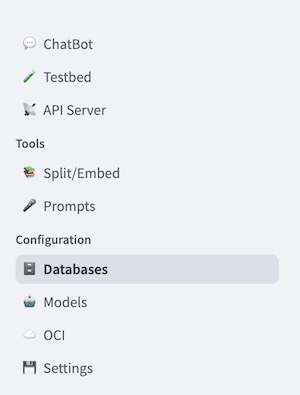
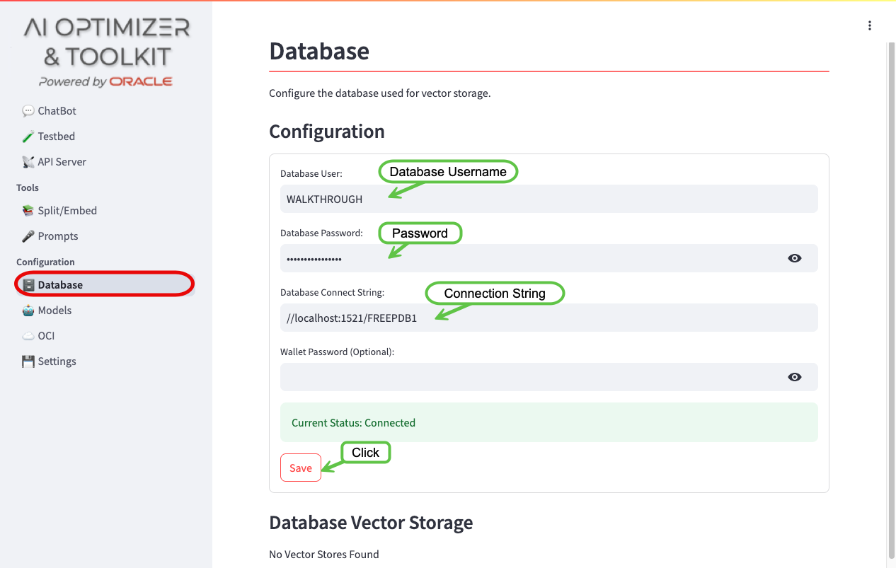
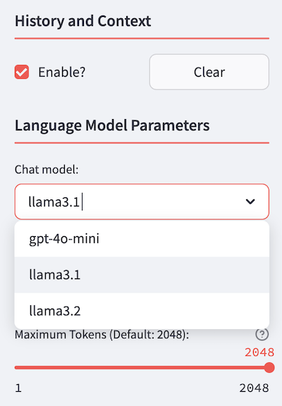

# Explore The Environment

## Introduction

In this lab, you will explore the environment that was created in the *Get Started* lab. You will set up the database connection, configure the OCI credentials, add new LLMs and Embedding models and test out the *Chat* feature for the first time.

Estimated Time: 15 minutes

### Objectives

In this lab, you will:
* Set the connection to your Oracle Database 23ai
* Set your Oracle Cloud Infrastructure credentials for OCI connectivity
* Configure the LLMs and embedding models you will use in the following labs
* Test the *Chat* feature for the first time

### Prerequisites

This lab assumes you have:
* An Oracle Database 23ai up and running
* Completed the *Get Started* Lab

## Task 1: Set the DB connection

Let's check if the DB is correctly connected.

1. Navigate to the *Databases* tab on the left side pane:

	

2. To configure the Oracle Database 23ai Free, you will need to enter the credentials:

   * Enter the Database Username: `WALKTHROUGH`
   * Enter the Database Password for the database user: `OrA_41_OpTIMIZER`
   * Enter the Database Connection String: `//localhost:1521/FREEPDB1`
   * Save
   
   

3. If you are using an Autonomous Database and have any SelectAI profile active, you'll find the list of Select AI profiles to activate:

   

## Task 2: Configure LLMs

Let's check the models available for use. You'll need to navigate to the *Models* tab:


   * The default LLMs for chat completions are:

     

  * The default LLMs for embeddings are:

     

   Let's add another LLM to the Ollama models and enable it. Open a terminal a window and follow these steps:

  * Pull the llama3.2 LLM:

      ```bash
      <copy>
         podman exec -it ollama ollama pull llama3.2
      </copy>
      ```
  * Now, you will need to enable it in the model list. Go back to the *Models* tab, under the *Language Models* section and press the *Add* button. Now fill in the form that just appeared with the values shown in the following snapshot:

      

  * (optional) If you are willing to use models by OpenAI, you will need to configure your **OPENAI API KEY**. To configure one, click the *Edit* button beside the model you would like to use (e.g., **gpt-4o-mini**) and add your own API key in the corresponding box:

         

  Now you are all set for using the *Chat* feature with the LLMs you just configured!

## Task 3: Test the *Chat* feature

The two LLMs availble could be tested right away, in order to understand their behavior with generic questions. First of all, navigate to the chat GUI


scroll down the left-side menu to find the **Toolkit** menu:


and then choose the **llama3.1** model: 



and ask generic questions like:

```text
<copy>
In Oracle Database 23ai, how do I determine the accuracy of my vector indexes?
</copy>
```

```text
<copy>
In Oracle Database 23ai, how do I convert string text to embedding using PL/SQL?
</copy>
```

> **NOTE**: *if you see a **Database has no Vector Stores. Disabling RAG.** message above, don't panic! That's because you haven't created a vector store yet and thus you can't use the RAG functionality*.

As you will probably be able to notice, even if the questions refer to Oracle Database 23ai, the LLM will mention Oracle Database 23c. This is known as **Knowledge Cutoff**, meaning that probably the LLM was trained before Oracle Database 23c was even renamed as 23ai. 

Moreover, the LLM tends to answer in a generic way, with no specific mention to the actual script needed to perform the operations requested. In Lab 3, we will compare these results with the one obtained using Retrieval-Augmented Generation (RAG), where more context is given to the LLMs.

## (Optional) Task 4: Set OCI Credentials

The Optimizer lets you configure the connection to your OCI tenant for retrieving objects from the *Object Storage* and accessing LLMs from the OCI GenAI service. In the *OCI* configuration tab, you can add your **Oracle Cloud Infrastructure** (OCI) credentials to authenticate to your OCI tenancy. This will enable access to objects and documents stored in your cloud compartments.

1. Navigate to the *OCI* tab on the left-hand pane:

   

2. Insert your OCI credentials. Detailed information on how to get the required credentials is available in the [Oracle Cloud Infrastructure Documentation](https://docs.oracle.com/en-us/iaas/Content/API/Concepts/apisigningkey.htm#Required_Keys_and_OCIDs).

   If you have previously created a `.oci/config` file, the framework will automatically read this file at startup and load the credentials from the Default profile for authentication. To create one, follow the instructions available in the [Quickstart Documentation](https://docs.oracle.com/en-us/iaas/Content/API/SDKDocs/cliinstall.htm#Quickstart).

   After entering your credentials, click the `Save` button. If the credentials are correct, a green confirmation pop-up will appear, indicating successful authentication to your tenancy.

   

## Learn More

* (optional) Now click the **Clear** button under the **History and Context** section, and choose the other available LLM, **gpt-4o-mini**. Then, ask the same questions and compare the results. Note that the History is enabled by default. The **Clear** button resets the *context window* and starts a fresh interaction with a model.

* (optional) Play with the **Temperature** parameter (and also the other parameters if you wish to!) and compare the quality of the answers, for each LLM that is available. Clear the history by pressing the **Clear** button after each cycle.

## Acknowledgements
* **Author** - Lorenzo De Marchis, Developer Evangelist, May 2025
* **Contributors** - Mark Nelson, John Lathouwers, Corrado De Bari, Jorge Ortiz Fuentes
* **Last Updated By** - Lorenzo De Marchis, May 2025
